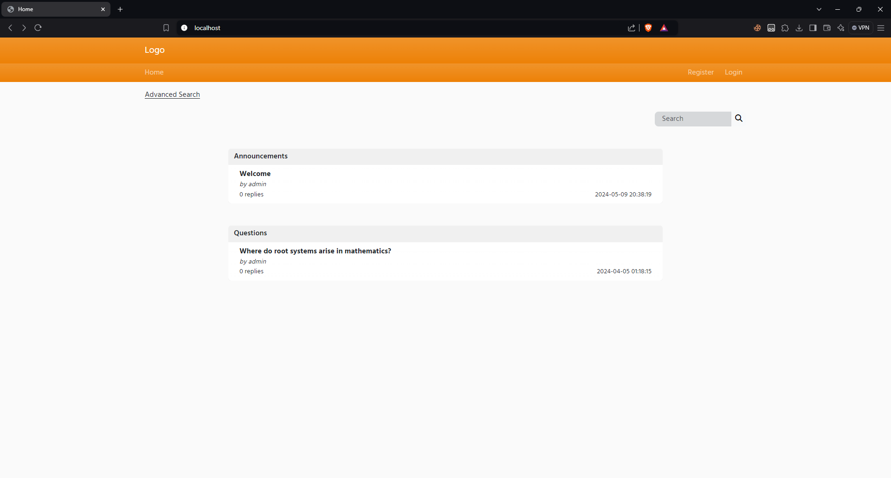

# Forum-Coursework
University coursework developed during my final year, using CodeIgniter with a React.js front-end framework.

## Description
This project was developed during my final year at university. The project was developed using PHP and JavaScript. It's a simple forums website where you can create and reply to posts.

## Setup
1. Create a MySQL database and import the `database.sql` file
2. Update `application/database.php` file with your database credentials
3. Run the project using a local server `php -S localhost:80`
4. Access the project in your browser `http://localhost`
5. Register a new account and add an entry for that user's id into the `staff` table
6. You can now use that account as an admin
7. Change the paths in the `application/config.php` file to match your setup so attachments work

## Design
The website looks like this, made using React.js as a front-end framework and CodeIgniter as the back-end framework

